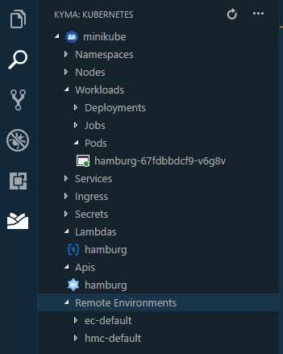

# Kyma Visual Studio Code Extension

## Installing
- Download the released .vsix file. 
- Go to extension in VS Code , click 3 dots and select install from vsix.
- Select the file.
- Reload.
- You need to have `kubectl` and `kubeless`* in your path.
- Refer to [How To Use](HowToUse.md) for details.

## Developing
- Clone this repo.
- `npm install` inside folder.
- Open the folder in VS Code. VS Code automatically detects it as a plugin.
- To run it, click `F5` or `Fn+F5`
- It will open a new VS code instance with the title `Extension Development host`, where the plugin will be installed.

## Roadmap

- [x] Kyma Logo  
- [x] See Kyma Resources
    - [x] Lambdas
    - [x] Apis
    - [x] Deployments
    - [x] Services
    - [x] Remote Environments
- [x] Hovering to function keyword reveals currently running functions.
- [x] Learn about Kyma Deployment files.
    - [x] provide hovering info to => servicecatalog.kyma.cx/v1alpha1
- [x] Provide schema validation for Kyma deployment files
    - [x] Add configuration option to change default port 
- [x] Snippets
    - [x] Lambda
    - [x] Api
    - [x] Deployment
- [x] Deploy to Kyma functionality
    - [x] Deploy 
    - [x] Expose
    - [x] deploy also lambdas in yaml files

- [ ] Install Kyma
- [ ] Add Service Instance
    - [ ] Redis
- [ ] Debugging for kubeless functions
    - [x] We can provide debugging for pods running the kubernetes functions. 
    - [x] Can map it to kubeless .js files.
    - [ ] exploring more debugging options.
    - [ ] put an action button in lambda functions.
    - [ ] Check syntax of lambda function in yaml file.

---
### Known Problems
- Check issues.
---
- \* This plugin currently relies on unstable version of `kubeless`. `Kubeless` had a bug that prevented this code from working correctly. While the issue is fixed now, the fix is in a unreleased version of kubeless. For more info: [Github issue](https://github.com/kubeless/kubeless/issues/874#event-1769345570)
